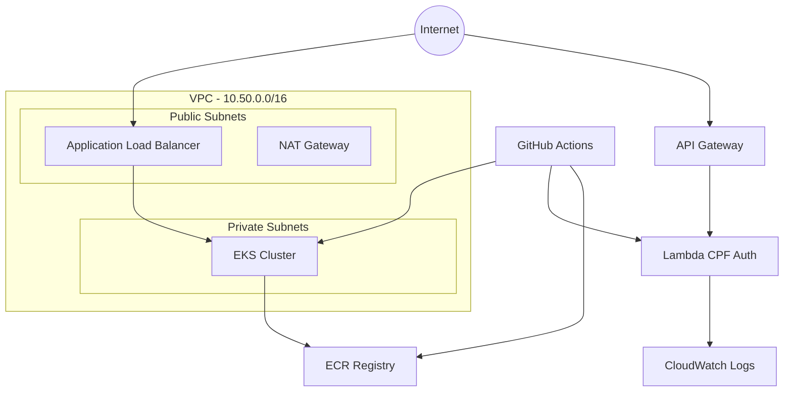

# 🚀 Fast Food Infrastructure - Terraform

[](https://www.terraform.io/)
[](https://aws.amazon.com/)
[](LICENSE)

> **Infraestrutura como Código (IaC)** para o sistema Fast Food - **FIAP 11SOAT Fase 3**

Esta infraestrutura implementa uma **arquitetura cloud-native** completa na AWS, incluindo Kubernetes (EKS), autenticação serverless e CI/CD seguro.

## 📋 Índice

- [🏗️ Arquitetura](#️-arquitetura)
- [🧩 Componentes](#-componentes)
- [📋 Pré-requisitos](#-pré-requisitos)
- [🚀 Como Usar](#-como-usar)
- [⚙️ Variáveis](#️-variáveis)
- [📤 Outputs](#-outputs)
- [🔒 Segurança](#-segurança)
- [📖 Documentação](#-documentação)
- [🤝 Contribuição](#-contribuição)

## 🏗️ Arquitetura



## 🧩 Componentes

| Componente | Descrição | Status |
|------------|-----------|--------|
| **🌐 VPC** | Rede isolada com subnets públicas/privadas | ✅ |
| **☸️ EKS** | Cluster Kubernetes gerenciado | ✅ |
| **📦 ECR** | Registry para imagens Docker | ✅ |
| **⚡ Lambda** | Função para autenticação CPF | ✅ |
| **🚪 API Gateway** | Endpoint HTTP para Lambda | ✅ |
| **🔐 IAM OIDC** | GitHub Actions sem secrets | ✅ |
| **📊 CloudWatch** | Logs e monitoramento | ✅ |
| **🛡️ Security Groups** | Controle de acesso de rede | ✅ |

### 🎯 Requisitos Específicos da Fase 3

- ✅ **API Gateway + Lambda** para autenticação por CPF
- ✅ **EKS** para aplicação principal em containers
- ✅ **Infrastructure as Code** com Terraform
- ✅ **CI/CD seguro** com OIDC (sem access keys)

## 📋 Pré-requisitos

### 🛠️ Ferramentas Necessárias

```bash
# Terraform
terraform --version  # >= 1.6.0

# AWS CLI
aws --version        # >= 2.0.0
aws configure        # Credenciais configuradas
```

### ☁️ Recursos AWS

- **Conta AWS** com permissões administrativas
- **Bucket S3** para artefatos da Lambda
- **Repositório GitHub** configurado

## 🚀 Como Usar

### 1. Clone e Navegue

```bash
git clone <seu-repositorio>
cd terraform/
```

### 2. Inicialize o Terraform

```bash
terraform init
```

### 3. Configure as Variáveis

Crie um arquivo `terraform.tfvars`:

```hcl
project_name        = "fastfood"
aws_region         = "sa-east-1"
github_org         = "seu-usuario"
github_repo        = "seu-repositorio"
lambda_s3_bucket   = "seu-bucket-lambda"
lambda_s3_key      = "lambda-cpf-auth.zip"
```

### 4. Planeje e Aplique

```bash
# Visualizar mudanças
terraform plan

# Aplicar infraestrutura
terraform apply
```

### 5. Configure kubectl (EKS)

```bash
aws eks update-kubeconfig --region sa-east-1 --name fastfood-eks
kubectl get nodes
```

## ⚙️ Variáveis

### Obrigatórias

| Variável | Descrição | Exemplo |
|----------|-----------|---------|
| `project_name` | Nome do projeto (prefixo recursos) | `"fastfood"` |
| `github_org` | Usuário/org GitHub | `"meu-usuario"` |
| `github_repo` | Nome do repositório | `"fast-food-app"` |
| `lambda_s3_bucket` | Bucket S3 para Lambda | `"meu-bucket-lambda"` |
| `lambda_s3_key` | Caminho do ZIP da Lambda | `"cpf-auth.zip"` |

### Opcionais

| Variável | Descrição | Padrão |
|----------|-----------|---------|
| `aws_region` | Região AWS | `"sa-east-1"` |
| `eks_version` | Versão do EKS | `"1.29"` |
| `lambda_runtime` | Runtime da Lambda | `"nodejs20.x"` |
| `allowed_cidrs_to_lb` | CIDRs permitidos no LB | `["0.0.0.0/0"]` |

## 📤 Outputs

Após o deploy, você receberá:

```bash
Outputs:

api_gateway_invoke_url = "https://abc123.execute-api.sa-east-1.amazonaws.com"
ecr_repository_url = "123456789.dkr.ecr.sa-east-1.amazonaws.com/fastfood-app"
eks_cluster_name = "fastfood-eks"
eks_cluster_endpoint = "https://ABC123.gr7.sa-east-1.eks.amazonaws.com"
github_actions_role_arn = "arn:aws:iam::123456789:role/fastfood-gha-deploy"
```

### 🔧 Uso dos Outputs

- **ECR URL**: Para push de imagens Docker
- **EKS Cluster**: Para configurar kubectl
- **API Gateway URL**: Para testar autenticação CPF
- **GitHub Role ARN**: Para configurar GitHub Actions

## 🔒 Segurança

### ✅ Boas Práticas Implementadas

- **🔐 OIDC**: GitHub Actions sem access keys de longa duração
- **🏠 VPC Privada**: EKS em subnets privadas
- **🛡️ IAM Least Privilege**: Permissões mínimas necessárias
- **📊 Logs**: CloudWatch para auditoria
- **🔍 ECR Scan**: Scan automático de vulnerabilidades

### 🚨 Configurações de Produção

Para produção, considere:

1. **Remote State**: Descomente o backend S3 em `versions.tf`
2. **Encryption**: Habilite encryption em todos os recursos
3. **WAF**: Adicione AWS WAF no API Gateway
4. **Backup**: Configure backup automático
